# Data-Analytics-Capstone

## Analysis of Academic Scores for NCAA Athletic Programs in Preparation for College Selection
by M. Susie Smith

### Abstract
Choosing a post-secondary school is an important decision for anyone. Student athletes must determine the athletic program that best suits them, but there is very little information available to them about how those athletic programs perform academically. Academic Performance Rate (APR) is a measure that the National Collegiate Athletic Association (NCAA) implemented in the early 2000’s to monitor how scholarship athletes were performing academically. If an athletic program has an APR that falls below a certain threshold, they can endure certain penalties so that the academic performance of the program can improve. Determining the factors that affect APR and being able to predict the academic performance of an athletic program is helpful for a potential student athlete choosing the best place to study and compete in college. This study used a dataset of APR’s for various Division 1 athletic programs in colleges and universities to determine was factors can affect APR. The dataset was trained and tested using Linear Regression, Scatterplot, K-Nearest Neighbors Regressor, Random Forest Classifier, Gradient Boosting Classifier, SVC, and K-Nearest Neighbors Classifier models. The accuracy of each model was evaluated using the test dataset. Maximum accuracy was achieved using Linear Regression model and it was found that eligibility, retention and school type (public or private) had the most affect on APR. Being able to evaluate the factors can help a potential student determine the best school for them based on the academic performance of the program. 

## Creating/Activating/Installing Project
1. Open Anaconda Prompt and change directory to preferred location
2. Create and activate the virtual environment
    -Type: python3 -m venv ds-venv
    -ds-venv\Scripts\Activate
3. Open jupyter notebook
    -Type jupyter notebook
4. Follow link if using jupyter notebook, otherwise open a new file "Untitled.ipynb"
6. Start project in notebook. 
7. Rename notebook
8. Make sure to reguarly commit.

## Research Goals
The focus of this project is to deliver information on which colleges would be the best fit academically for a student athlete. This data analysis gives student athletes a broader understanding of what to look for when searching for colleges. There is quite a bit of information available that focuses on athletic performance and how an athletic program would fit into a student athlete's future. This data analysis focuses on the academic portion of the athletic program. Student athletes need to consider how they will succeed academically once they choose a college. Further, colleges may be looking for a certain type of student to fill their roster that will maintain and/or raise academic success in their program.

##  Data Collection
The data for this project was obtained through Kaggle. The link to the dataset is provided here: https://www.kaggle.com/datasets/ncaa/academic-scores
The dataset is comprised of structured data consisting of integers, decimals and string fields. The original dataset has around 6500 records with each record containing 57 fields. There are a few fields that are not value-added to the analysis, so they have been deleted from the dataset. The records were deleted from the dataset by simply using filters in an excel table, deleting the records once identified, and saving the resulting excel file as a csv. Saving as this type of file ensures that the dataset canb be read into the R program used. Table 1 shows the resulting dataset with its different fields, their descriptions and the data types.

### Data Collection Issues
College athletic program APR's have regularly been calculated since its inception in 2004. There is a database on the NCAA website that is very user friendly but does not have easily exportable data for the years 2004-2024. The dataset used for this project has information for the years 2004-2014 which provides data for analysis, obtained from a Kaggle dataset. It should be noted that more recent data is more pertinent for current student athletes and potential collegiate athletes. 

### Data Curation
Selecting the dataset used was somewhat challenging. The dataset used is from the years 2004-2014, which is not exactly relevant for current athletes to seek a college athletic program. As mentioned before, the NCAA has a user-friendly interface where athletes can review the APR, eligibility and retention scores for athletic programs, but this data is not exportable so that further analysis can be done. 

The dataset was inspected for validity, missing values and irrelevant data attributes. During inspection, a data attribute called "Subdivision" was removed, as this is not a well-known attribute commonly evaluated when selecting colleges. 

The most time spent on cleaning the data was on missing values that were filled in using the number "-99." These missing values were found under the attributes FOURYEAR\_ATHLETES, FOURYEAR\_SCORE, FOURYEAR\_ELIGIBILITY, FOURYEAR\_RETENTION, and these same attributes for each individual year. 

### Data Cleaning Process
In order to get relevant data, the extent of the missing values in each record was assessed. Missing values that took up a large part of certain records were eliminated. Records with at least 80 percent of their data had the average of each year calculated to fill in the missing information. The dataset spreads from 2004-2014 and each year has four attributes: number of athletes, score (APR), eligibility, and retention. Eligibility and retention affect the APR. To fill in the missing data for each record, an average of each attribute was calculated and applied to the missing years. The average of the remaining years in that record were calculated for each missing attribute. All of the average calculations and data cleaning in this part of the process were done in Microsoft Excel using filters, formulas and pasting as numbers. 

### Data Cleaning Issues
There were 668 records eliminated due to excessive missing values. Most of these missing values were smaller athletic programs, specifically in the Division 2 or Division 3 programs. This limits the data for Division 2 and 3 programs, so the scope of the analysis was changed to only focus on Division 1 programs. Therefore, 51 more records were eliminated in Excel because they were Division 2 or 3 programs. 

### Prepared Data
The data was cleaned and is ready to analyze. Table 1 shows the different fields, their descriptions and the data types. The analysis will focus on what colleges will be the best choice for an athlete from an academic perspective. This problem is being looked at from the standpoint of a prospective student athlete, so the preference of the school is going to depend on the APR. Therefore, the APR, eligibility, and retention are all independent variables in this unique situation and the school is the dependent variable. 

## Data Analysis
The python notebooks for this project are available at: https://github.com/msmixj/Data-Analytics-Capstone 

### Exploratory Data Analysis
Exploratory Data Analysis is the process of initial analysis using graphical representations and summary statistics to gain inferences about data. This is an essential part of a data analysis project. It is good practice to understand the data and gather as many insights before it is too far into the exploration. If the analysis takes a different direction, it is easier to shift.

### Methods Used
Methods used to complete exploratory data analysis includes plotting and using visual graphics. Jupyter Notebook and VS Code were used as tools. Many packages were imported including pandas, numpy, seaborn, and matplotlib. 

### Relationships/Trends/Patterns
Initial evaluation of the data showed that there is an immense amount of data that can be explored and looked into. A histogram portrayed in Figure 4 shows that the APR's are skewed to the right, and many scores are above the 930 threshold, which is the minimum score needed to avoid penalties. 

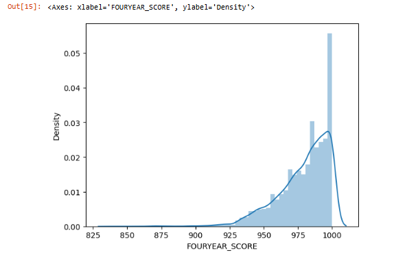

Due to the many programs available per sport, and the fact that athletes will not choose a sport to play based on the APR of an athletic program, a case study will be used to show the possible outcomes of the data analysis. 

### Case Study
This section explains how an athlete can use the information analyzed to help with their college making decision. The analysis presented will go through various examples of a what information a student athlete can use to make an informed decision on a college athletic program. 

### Softball Athlete Selecting Program
In order to analyze the data for a softball program, filters had to be set to just pull information and plot information for all the Women's Softball programs. Figure 5 shows the code and visuals of how that was done. 

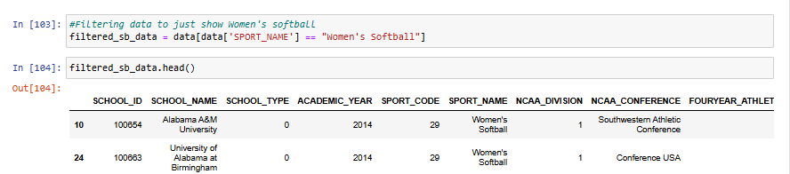

The analysis continued by looking into the APR's of each conference. From there, the three conferences with the highest APR's were selected to look into the APR of each school in those conferences. The top three conferences were the Ivy League, Patriot League, and the Big East Conference. Figures 6 and 7 shows the coding and visual of the conference APR's.

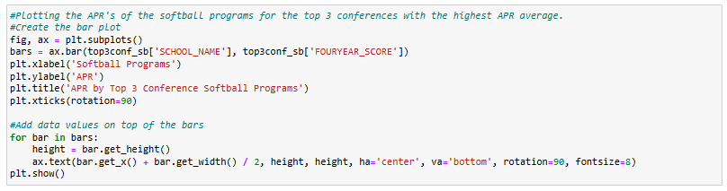
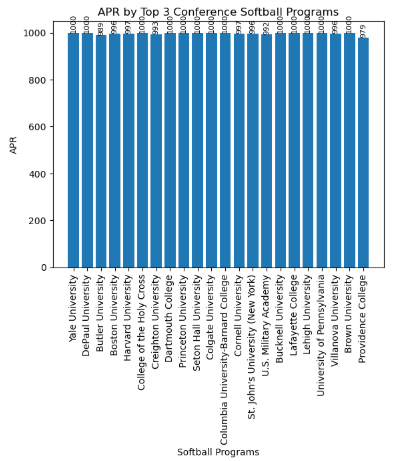

Since it is obvious the schools that have an APR of 1000 have 100 percent eligibility and 100 percent retention in their programs, schools that did not have an APR of 1000 were plotted and reviewed. Figures 8, 9 and 10 show three different visuals of their APR, the overall retention and eligibility for each school and the APR score plotted over the time frame of 2004-2014.  
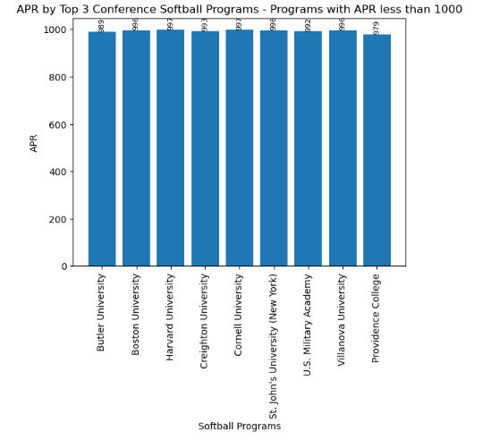

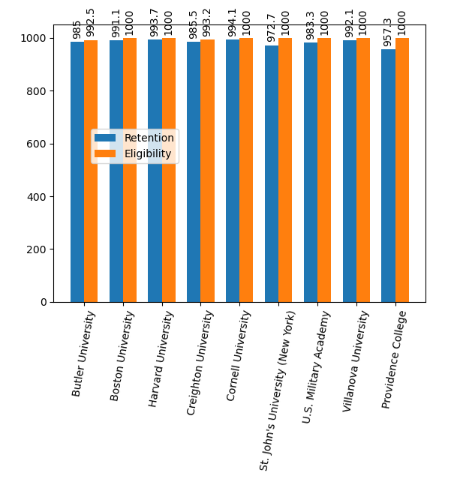

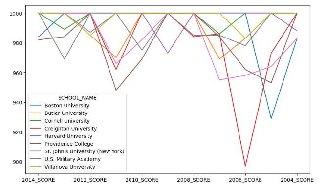

#### Further Exploration Into Eligibility and Retention
Looking further into eligibility and retention
Creighton Retention and Eligibility: 
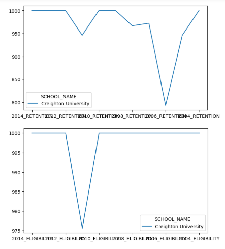

## Exploratory Data Analysis Issues
The exploratory data analysis exercise showed that it will be difficult to train models and complete machine learning with the variables chosen and the dataset used. If the dataset included the incidence of the athletic programs chosen over the years and it was possible to compare the incidence to the APR, retention and eligibility, then machine learning would be able to be used to predict what school would be best or at least would be most likely to be chosen. 

The dataset, however, does not include incidence of the athletic programs chosen over the years so the variables must be shifted in order to do predictive analysis. Therefore, predictive analysis will explore coefficients of independent variables to confirm that they do have an impact on the APR (the variable we are now selecting as the dependent variable). Once that is confirmed, models will be selected to be analyzed and predictive analysis will be completed. 

## Predictive Analysis
In order to begin predictive analysis, the dataset must be reassessed to confirm that all of the components in the dataset are in the correct format. The dependent variable analyzed is Academic Progress Rate (APR). The independent variables are assumed, so statistical analysis is used to confirm that the independent variables affect the dependent variable. The assumed independent variables include retention, eligibility, the school, the conference, and the school type (public or private). 

### Data Cleaning for Predictive Analysis
NCAA conference included in the dataset was in string format, so a new column was created to assign a numerical identifier to each conference. It was also discovered during analysis that retention, eligibility and APR need to be the same number format (percentage vs. raw number/decimal format), in order for the predictive analysis to work correctly. Therefore, eligibility and retention need to be multiplied by 1000 to be the same format. The code used to create the column and change all of the eligibility and retention numbers to the same number type as APR is shown in Figure 12.
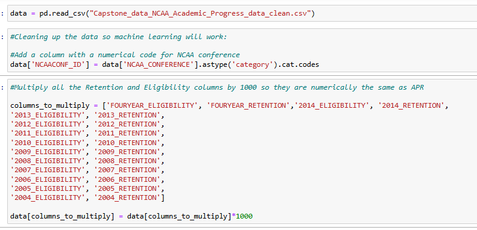

### Machine Learning Models
Several machine learning models were selected to train and test the data. The models used to analyze the data included Linear Regression, Scatterplot, K-Nearest Neighbors Regressor, Random Forest Classifier, Gradient Boosting Classifier, SVC, and K-Nearest Neighbors Classifier. 

To train and test the data, the 80/20 rule was used where 80 percent of the data was used to train the model and 20 percent of the data was used to test the model. The features (aka independent variables) used were eligibility, retention, school ID, school type (private or public), and NCAA conference ID. The target (aka dependent variable) was the Academic Performance Rate (APR). First, the data was split into training and test sets. Next, the model was created and fit. Predictions were then made and then the model was evaluated for accuracy. Visualizations were also employed to help see the model.

#### Linear Regression Model
Linear Regression Model was the first model to be used. Figure 13 shows the code used in Jupyter Notebook. 

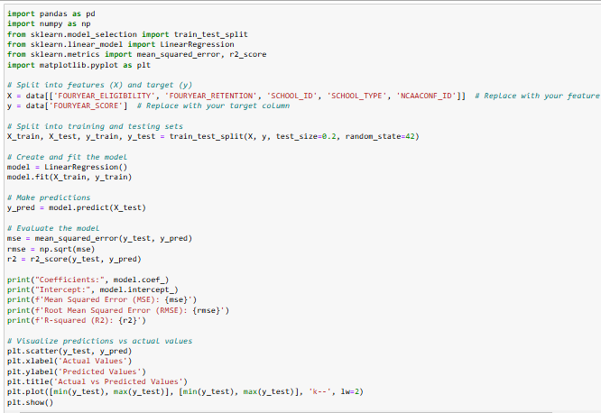

The coefficients of the independent variables were analyzed and it was found that three independent variables showed about a 43 percent correlation to the dependent variable. Those variables included retention, eligibility and school type. School ID and NCAA Conference ID did not have a strong enough correlation to the dependent variable to warrant a significant relationship exists. Figure 14 shows the results of the coefficient, linear regression results and the predicted vs. actual APR. 

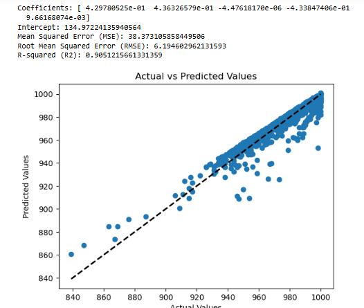

Root Mean Squared Error for linear regression had a result of 6.19 and the R squared (R2), which predicts the accuracy of the model was .905 or 90 percent. This shows a fairly strong accuracy of the test model. 