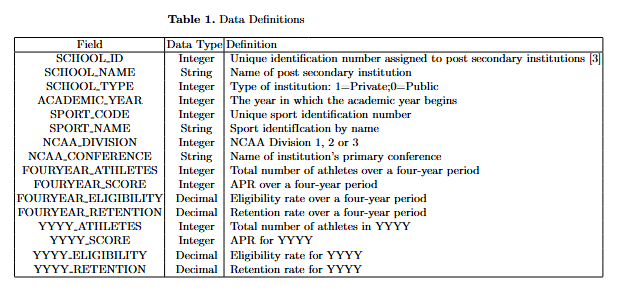

# Data-Analytics-Capstone

## Analysis of Academic Scores for NCAA Athletic Programs in Preparation for College Selection
by M. Susie Smith

### Abstract
Choosing a post-secondary school is an important decision for anyone. Student athletes must determine the athletic program that best suits them, but there is very little information available to them about how those athletic programs perform academically. Academic Performance Rate (APR) is a measure that the National Collegiate Athletic Association (NCAA) implemented in the early 2000’s to monitor how scholarship athletes were performing academically. If an athletic program has an APR that falls below a certain threshold, they can endure certain penalties so that the academic performance of the program can improve. Determining the factors that affect APR and being able to predict the academic performance of an athletic program is helpful for a potential student athlete choosing the best place to study and compete in college. This study used a dataset of APR’s for various Division 1 athletic programs in colleges and universities to determine was factors can affect APR. The dataset was trained and tested using Linear Regression, Scatterplot, K-Nearest Neighbors Regressor, Random Forest Classifier, Gradient Boosting Classifier, SVC, and K-Nearest Neighbors Classifier models. The accuracy of each model was evaluated using the test dataset. Maximum accuracy was achieved using Linear Regression model and it was found that eligibility, retention and school type (public or private) had the most affect on APR. Being able to evaluate the factors can help a potential student determine the best school for them based on the academic performance of the program. 

## Creating/Activating/Installing Project
1. Open Anaconda Prompt and change directory to preferred location
2. Create and activate the virtual environment
    -Type: python3 -m venv ds-venv
    -ds-venv\Scripts\Activate
3. Open jupyter notebook
    -Type jupyter notebook
4. Follow link if using jupyter notebook, otherwise open a new file "Untitled.ipynb"
6. Start project in notebook. 
7. Rename notebook
8. Make sure to reguarly commit.

## Research Goals
The focus of this project is to deliver information on which colleges would be the best fit academically for a student athlete. This data analysis gives student athletes a broader understanding of what to look for when searching for colleges. There is quite a bit of information available that focuses on athletic performance and how an athletic program would fit into a student athlete's future. This data analysis focuses on the academic portion of the athletic program. Student athletes need to consider how they will succeed academically once they choose a college. Further, colleges may be looking for a certain type of student to fill their roster that will maintain and/or raise academic success in their program.

##  Data Collection
The data for this project was obtained through Kaggle. The link to the dataset is provided here: https://www.kaggle.com/datasets/ncaa/academic-scores
The dataset is comprised of structured data consisting of integers, decimals and string fields. The original dataset has around 6500 records with each record containing 57 fields. There are a few fields that are not value-added to the analysis, so they have been deleted from the dataset. The records were deleted from the dataset by simply using filters in an excel table, deleting the records once identified, and saving the resulting excel file as a csv. Saving as this type of file ensures that the dataset canb be read into the R program used. Table 1 shows the resulting dataset with its different fields, their descriptions and the data types.

